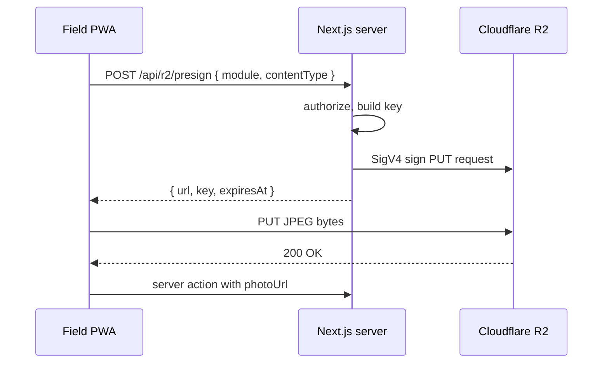

# API surface

Zameen exposes three categories of write surface and one of read surface.

1. **Next.js Server Actions** in each of the four apps. The primary mutation channel.
2. **Supabase Edge Functions** at `supabase/functions/*` with cron triggers via `pg_cron`. Background processing.
3. **PostgREST RPCs** exposed through the Supabase auto-generated API. Used by the Field PWA when offline-queued mutations drain (no Next.js round-trip), and by future external integrations.
4. **PostgREST table queries** for reads, scoped by RLS.

There is no separate REST API surface. There is no GraphQL.

## Error envelope

All server actions and RPCs return a discriminated union.

```ts
type Result<T> =
  | { ok: true; data: T }
  | { ok: false; error: string; code?: string; details?: unknown };
```

Known error codes:

- `unauthenticated`, `forbidden`, `not-found`, `validation-failed`.
- `illegal-approval-transition`, `approval-required`, `approval-cannot-act`.
- `duplicate-idempotent`, `duplicate-divergent`.
- `r2-presign-failed`, `photo-too-large`, `photo-format-rejected`.
- `variance-exceeded`, `journal-unbalanced`.

Errors are never thrown across the action boundary; they are returned. The Field PWA shows a toast keyed on `code` with localized copy.

## Idempotency

Every offline-queued mutation carries `idempotencyKey` (UUID v7). The server-side action upserts on this key. Replays return the original record. Divergent payloads under the same key return `code: 'duplicate-divergent'` and are surfaced for human review on the Ops dashboard.

Idempotency keys are stored in `system.idempotency_keys` with `(entity_id, key)` unique. TTL is 30 days; the cleanup job runs nightly.

## Server actions, per app

### `apps/web` (management dashboard, port 3000)

- `createEntity`, `updateEntitySettings` (director only).
- `createFarm`, `createBlock`, `createField`, `setFieldGeometry`.
- `createCropPlan`, `updateCropPlan`, `closeCropPlan`.
- `createAsset`, `retireAsset`.
- `createVendor`, `updateVendor`.
- `createUserRole`, `setDelegation`, `revokeRole`.

### `apps/field` (worker PWA, port 3001)

- `logAttendance`, `logCropStage`.
- `logDieselDaily`, `submitDieselPurchase`.
- `raiseRepairRequest`, `submitRepairQuote`.
- `uploadPhoto` (returns presigned URL flow, see below).
- `logMilkDaily`, `logVetVisit`.

### `apps/ops` (supervisor and accountant, port 3002)

- `issueInputToField`, `recordHarvest`, `recordMandiSettlement`.
- `postCashEntry`, `closeWeek`.
- `selectRepairQuote`, `closeWorkOrder`.
- `reconcileDieselStock`.

### `apps/approve` (Approver PWA, port 3003)

- `actOnApproval` (approve, reject, send-back, escalate, comment).
- `emergencyExecute` (director or super_admin only).
- `reverseApproval` (within 24h or director only).

Each action is a `'use server'` function in `app/<route>/actions.ts`. Authentication is via Supabase session cookie; authorization is via RLS plus a `requireRole` guard at the action entry.

## PostgREST RPCs

These RPCs live in the database as `SECURITY DEFINER` Postgres functions, exposed via Supabase's `/rest/v1/rpc/<name>`. They are the canonical write path for offline-queued mutations because they tolerate a round-trip without Next.js middleware.

### `rpc.submit_approval`

Submit a new approval request. Wrapped by `submitApproval()` in `@zameen/approvals/engine.ts`; the RPC is for the offline queue path.

Signature:
```
submit_approval(
  p_entity_id uuid,
  p_approval_type approval_type,
  p_source_module text,
  p_source_record_id uuid,
  p_title text,
  p_title_ur text,
  p_amount_pkr numeric,
  p_payload jsonb,
  p_context_snapshot jsonb,
  p_idempotency_key uuid
) returns approval_requests
```

Input (zod-equivalent):
```
{
  entityId: uuid,
  approvalType: enum APPROVAL_TYPES,
  sourceModule: string (1..40),
  sourceRecordId: uuid | null,
  title: string (1..200),
  titleUr: string (1..200) | null,
  amountPkr: number >= 0 | null,
  payload: record<string, unknown>,
  contextSnapshot: record<string, unknown> | null,
  idempotencyKey: uuid
}
```

Output: full `approval_requests` row.

RLS: caller must have an active role on `p_entity_id`. The RPC sets `requested_by = auth.uid()`. Routing (first approver) is computed inside the function from `approval_workflows` + `entity_settings.approval_thresholds`.

Example:
```sql
select * from rpc.submit_approval(
  'e1f2…'::uuid, 'diesel_purchase', 'diesel',
  'a8b9…'::uuid, 'Diesel 200L PSO Raiwind', 'ڈیزل دو سو لیٹر',
  18500.00, '{"vendor":"PSO","litres":200}'::jsonb,
  '{"cashPosition":425000}'::jsonb, gen_random_uuid()
);
```

### `rpc.act_on_approval`

Apply an action to a pending request. Wraps `decide()` plus state-machine validation.

Signature:
```
act_on_approval(
  p_request_id uuid,
  p_action approval_action,
  p_comment text,
  p_comment_ur text,
  p_gps jsonb,
  p_ip inet,
  p_ua text
) returns approval_requests
```

Input:
```
{
  requestId: uuid,
  action: 'approve' | 'reject' | 'send_back' | 'escalate' | 'comment',
  comment: string (0..1000) | null,
  commentUr: string (0..1000) | null,
  gps: { lat: number, lng: number, accuracyM?: number } | null,
  ip: string (inet) | null,
  ua: string | null
}
```

Output: updated `approval_requests` row.

RLS: caller must be `current_approver_id` for `approve`/`reject`/`send_back`/`escalate`, or a director-rank user for any pending request. `comment` is allowed by any role with read access.

### `rpc.allocate_input_to_field`

Record an input issuance (seed, fertilizer, pesticide) from store to a field, with cost tagging.

Signature:
```
allocate_input_to_field(
  p_entity_id uuid,
  p_input_id uuid,
  p_field_id uuid,
  p_crop_plan_id uuid,
  p_quantity numeric,
  p_unit text,
  p_issued_on date,
  p_idempotency_key uuid
) returns cost_allocations
```

Input:
```
{
  entityId, inputId, fieldId, cropPlanId: uuid,
  quantity: number > 0,
  unit: 'kg' | 'litre' | 'bag' | 'bottle',
  issuedOn: date,
  idempotencyKey: uuid
}
```

Output: `cost_allocations` row with `cost_pool` resolved from the input's category (seed, fertilizer, pesticide).

RLS: caller has `worker` or above on `p_entity_id`. The function deducts from `inventory_balances`, writes `inventory_issuances`, and writes `cost_allocations` in one transaction.

### `rpc.log_diesel_daily`

Daily diesel issuance log with hour-meter reading and field allocation.

Signature:
```
log_diesel_daily(
  p_entity_id uuid,
  p_asset_id uuid,
  p_field_id uuid,
  p_operator_id uuid,
  p_litres numeric,
  p_hour_meter_start numeric,
  p_hour_meter_end numeric,
  p_logged_on date,
  p_photo_url text,
  p_gps jsonb,
  p_idempotency_key uuid
) returns diesel_daily_logs
```

Input:
```
{
  entityId, assetId, fieldId, operatorId: uuid,
  litres: number > 0,
  hourMeterStart: number >= 0,
  hourMeterEnd: number >= hourMeterStart,
  loggedOn: date,
  photoUrl: string (https://...) | null,
  gps: { lat, lng, accuracyM? } | null,
  idempotencyKey: uuid
}
```

Output: `diesel_daily_logs` row. Side effects: cost allocation to `cost_pool='diesel'`, deduction from `diesel_stock`, fuel-burn anomaly check against `ASSET_FUEL_BURN_ANOMALY_PCT`.

RLS: worker or above on entity; asset must belong to entity.

### `rpc.compute_field_pnl`

Per-field P&L for a crop plan. Read-only.

Signature:
```
compute_field_pnl(p_crop_plan_id uuid)
  returns table (
    field_id uuid,
    crop_plan_id uuid,
    revenue_pkr numeric,
    cost_by_pool jsonb,
    total_cost_pkr numeric,
    gross_margin_pkr numeric,
    margin_per_acre_pkr numeric,
    yield_kg numeric,
    yield_per_acre_kg numeric
  )
```

Output matches the `FieldPnL` interface in `@zameen/finance`. RLS: read access on the entity owning the crop plan.

## Storage upload (Cloudflare R2)

The platform does not stream bytes through the Next.js server. The upload is presigned.



Presign endpoint: `POST /api/r2/presign` with body `{ entityId, module, contentType }`. The server returns:

```
{
  url: "https://<account>.r2.cloudflarestorage.com/<bucket>/<key>?X-Amz-...",
  key: "entities/<entityId>/<module>/2026/05/<uuid>.jpg",
  expiresAt: "2026-05-17T13:45:00Z"
}
```

TTL is 10 minutes. The key embeds entity ID for downstream access control.

## WhatsApp webhook

The WhatsApp Business notification dispatcher is a Phase 2 deliverable. The webhook contract is locked.

Endpoint: `POST https://api.agri.feerasta.ai/webhooks/whatsapp`.

Inbound payload (Meta Cloud API):
```json
{
  "object": "whatsapp_business_account",
  "entry": [{
    "id": "<waba-id>",
    "changes": [{
      "field": "messages",
      "value": {
        "messaging_product": "whatsapp",
        "metadata": { "display_phone_number": "...", "phone_number_id": "..." },
        "contacts": [{ "wa_id": "923xxxxxxxxx", "profile": { "name": "..." } }],
        "messages": [{
          "from": "923xxxxxxxxx",
          "id": "wamid....",
          "timestamp": "1747490100",
          "type": "text",
          "text": { "body": "ok" }
        }]
      }
    }]
  }]
}
```

The dispatcher rejects any inbound message that contains the words `approve`, `reject`, `accept`, or their Urdu equivalents. The reply is a deep link into the Approver PWA: `https://approve.agri.feerasta.ai/r/<requestId>?t=<oneTimeToken>`. Approve and reject actions never happen over WhatsApp. ADR 0003 covers why.

Outbound: template messages only. Template IDs are managed in `entity_settings.whatsapp_templates`.

## Edge Functions and cron

Phase 2 functions, listed for forward compatibility.

| Function | Trigger | Payload |
|---|---|---|
| `reconcile-diesel-daily` | `pg_cron` 22:00 PKT daily | `{ entityId }` per active entity |
| `flag-fuel-burn-anomalies` | `pg_cron` 22:30 PKT daily | `{ assetId, windowDays: 30 }` |
| `notify-whatsapp` | `LISTEN/NOTIFY` on `approval_submitted` | `{ approvalRequestId }` |
| `daily-pnl-snapshot` | `pg_cron` 23:00 PKT daily | `{ entityId }` |
| `purge-idempotency` | `pg_cron` 03:00 PKT daily | `{}` |
| `r2-lifecycle-tag` | `pg_cron` weekly Sun 02:00 | `{}` |

`pg_net` is used for outbound HTTP calls from Postgres where the function needs to reach an external API. No Redis; queues are Postgres rows with `state` and `next_attempt_at` columns. ADR 0008 (deferred) covers the queue choice.

## Authentication

- Supabase Auth, phone OTP primary.
- Session lifetime: 12 hours for worker, 7 days for management roles, 24 hours for the Approver PWA.
- Service-to-service: JWT signed with the entity's service key, only for the edge function path.

## Rate limits

- Server actions: 30 requests per minute per session, enforced at the Next.js middleware.
- RPCs: 60 requests per minute per session, enforced via PostgREST.
- R2 presign: 20 per minute per session.
- WhatsApp webhook: Meta-enforced; we accept up to 80 per second.

## Versioning

The API surface is not versioned externally because there is no external consumer yet. Internal callers (the four apps) move in lockstep with the schema. Once Phase 4 external onboarding lands, RPC namespacing moves to `rpc_v1.*` and a deprecation policy is published.
